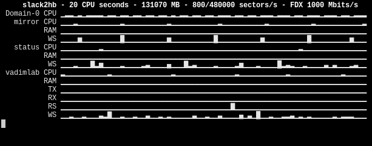

# _No Web Required_

Performance monitoring from the terminal.  
Currently only XEN (as with `xentop`) is supported.  
To be executed on every single node.  

## Requirements

Make sure you have XEN up and running

	xl info
	xentop -b -i1 | head

Make sure all your guests have [TMEM](https://pub.nethence.com/xen/tmem) [enabled](https://wiki.xenproject.org/wiki/TMEM).
Otherwise disable RAM from the graphs by setting `showram=0` in the configuration.

Make sure you've got KSH93 available on your dom0 (floating point capable).

Get ready for sparkles.  Note there's [spark.bash](https://github.com/holman/spark) as an alternative (untested).

	wget https://git.zx2c4.com/spark/plain/spark.c
	gcc -o spark spark.c -lm
	cp -i spark /usr/local/bin/

## Setup

CPU power, MAXMEM and NIC speed is evaluated dynamically.
However DISK speed is tricky to determine (in sectors of 512 bytes per second).
Some testing is advised to correctly define max values for disk performance.

_domU_

	hdparm -t /dev/xvda1

_dom0_

	cp nwr.conf /etc/
	vi /etc/nwr.conf

## Usage

We want to use system's memory instead of expansive disk i/o.  Assuming `/tmp/` is on `tmpfs` already

	mount | grep tmpfs

otherwise

	mkdir /tmp/fastio/
	#mount -t tmpfs -o size=2G tmpfs /tmp/fastio/
	vi /etc/fstab

	tmpfs /tmp/fastio tmpfs nosuid,nodev,noexec,async,noatime,nodiratime,size=2097152k 0 0

	mount /mnt/fastio/

Start the TUI

	screen -S NWR

	cd ~/nwr/
	./nwr.ksh

and when finished

	rm -rf /tmp/fastio/
	#umount /tmp/fastio/

## Acceptance testing

_on some guest_

	# debian/ubuntu
	apt install -y stress iperf3 hdparm

	# slackware
        slackpkg update
	slackpkg install screen-4 utempter
        slackpkg install rsync cyrus-sasl curl lz4 zstd xxHash nghttp2 brotli
        slackpkg install kernel-headers patch gcc-11 automake autoconf-2 binutils make guile gc
        wget https://github.com/sbopkg/sbopkg/releases/download/0.38.2/sbopkg-0.38.2-noarch-1_wsr.tgz
        installpkg --terse sbopkg-0.38.2-noarch-1_wsr.tgz
        sbopkg -r
        sbopkg -i stress
	sbopkg -i perf3
	slackpkg install hdparm

CPU

	grep ^proc /proc/cpuinfo
	stress --cpu 2

RAM

_(assuming tmem)_

	lsmod | grep tmem

<!--
	stress --vm 2 --vm-keep
-->

	screen -S ram
	mkdir -p ram/
	mount -t tmpfs -o size=7168M tmpfs ram/
	dd if=/dev/zero of=ram/lala bs=1

	watch free -m

it will then shrink back by itself

	umount ram/
	rmdir ram/

RSECT

	hdparm -Tt /dev/xvda1
	dd if=/dev/xvda1 of=/dev/null bs=1M count=1024

WSECT

	dd if=/dev/zero of=lala bs=1M count=1024 conv=sync
	rm -f lala

TX (upload)

_assuming you got a server listening on your LAN_

	iperf3 -c IPERF-SERVER

RX (download)

	iperf3 -R -c IPERF-SERVER

## Troubleshooting

	SIOCGMIIPHY on 'guestbr0' failed: Operation not supported

==> point to the underlying interface, not the bridge itself.

<!--
## Bugs

depending on the load and how long the xentop iteration takes to complete, we are not exactly dealing with metrics every second,
but rather two or three seconds interval, which messes up the results as those are compared against the defined bandwidth maximum values.
-->

